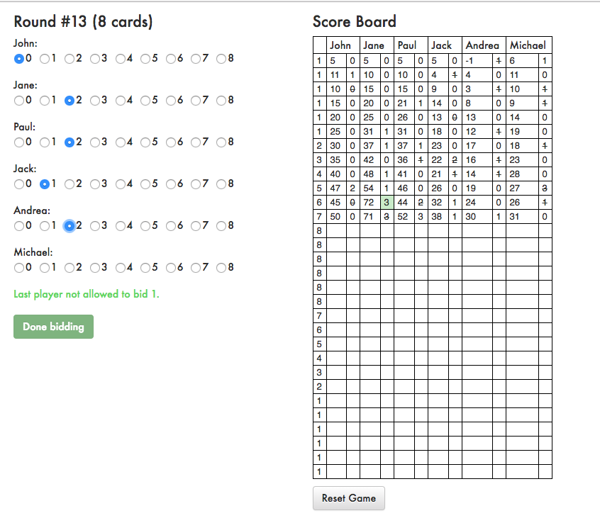

# Whist Score

Score keeper for the card game of Whist.

## Description

To play, just click on *Start Game*, add the players and follow the instructions.

The application can be accessed here: [http://whist.mateicarpen.co.uk](http://whist.mateicarpen.co.uk).

### Screenshot



## Installation

```
git clone git@github.com:mateicarpen/whist.git
cd whist

npm install

npm start # this will run the app locally
# OR
npm run build # this will compile the app into the /build folder
```

## Technologies used

- React.js 16
- Redux 4
